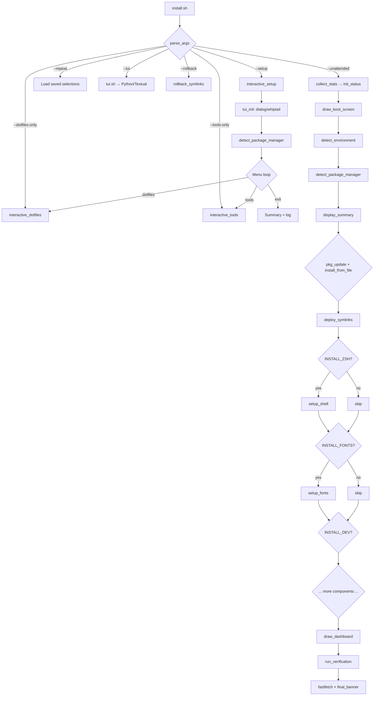
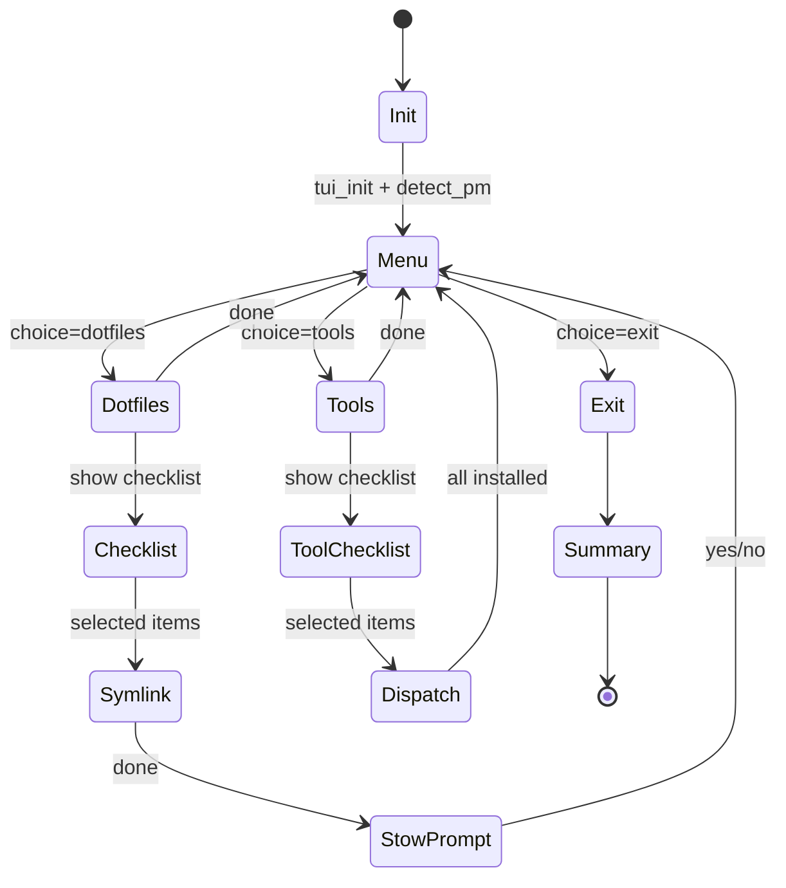
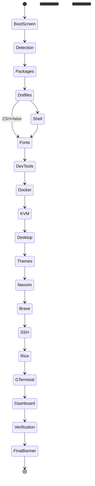

# Architecture

> **Documentation version:** 2.0.0

---

## Execution Flow



---

## State Machine: Interactive Mode



---

## State Machine: Automated Mode



---

## Data Flow

```
┌──────────┐       ┌─────────────────────┐       ┌──────────────┐
│  .env    │──────▶│  import_env_config  │──────▶│  Global vars │
└──────────┘       └─────────────────────┘       │  GIT_USERNAME│
                                                  │  DESKTOP_... │
┌──────────┐       ┌─────────────────────┐       └──────────────┘
│  CLI     │──────▶│  parse_args         │──────▶│  Flag vars   │
│  flags   │       │  (while/shift loop) │       │  SETUP_MODE  │
└──────────┘       └─────────────────────┘       │  INSTALL_*   │
                                                  └──────────────┘
┌──────────┐       ┌─────────────────────┐       ┌──────────────┐
│  Stow    │──────▶│  dotfile_source     │──────▶│  Source path │
│  dirs    │       │  (searches stow/*/) │       │  for symlink │
└──────────┘       └─────────────────────┘       └──────────────┘
                                                  ┌──────────────┐
┌──────────┐       ┌─────────────────────┐       │  Symlinks in │
│  Target  │──────▶│  install_dotfile     │──────▶│  $HOME       │
│  $HOME/  │       │  backup → rm → ln    │       │  + backups   │
└──────────┘       └─────────────────────┘       └──────────────┘

┌──────────┐       ┌─────────────────────┐       ┌──────────────┐
│  TUI     │──────▶│  Selections saved   │──────▶│  selections  │
│  choices │       │  to selections.cfg   │       │  .cfg file   │
└──────────┘       └─────────────────────┘       └──────────────┘

┌──────────┐       ┌─────────────────────┐       ┌──────────────┐
│  Actions │──────▶│  Logging functions  │──────▶│  install-*.  │
│  (all)   │       │  (tee to file+stderr)│       │  log + history│
└──────────┘       └─────────────────────┘       └──────────────┘
```

---

## Module Dependency Graph

```
install.sh
├── scripts/core/
│   ├── colors.sh         (no deps)
│   ├── detect.sh         (no deps)
│   ├── logging.sh        (colors.sh)
│   ├── ui.sh             (colors.sh, logging.sh)
│   └── utils.sh          (no deps)
├── scripts/pkg/manager.sh (detect.sh)
├── scripts/dotfiles/deploy.sh (logging.sh, utils.sh)
├── scripts/setup/
│   ├── shell.sh          (pkg/manager.sh)
│   ├── dev.sh            (pkg/manager.sh)
│   ├── fonts.sh          (pkg/manager.sh)
│   ├── docker.sh         (pkg/manager.sh)
│   ├── kvm.sh            (pkg/manager.sh)
│   ├── desktop.sh        (detect.sh, utils.sh)
│   ├── themes.sh         (pkg/manager.sh, utils.sh)
│   ├── neovim.sh         (pkg/manager.sh)
│   ├── brave.sh          (pkg/manager.sh)
│   └── ssh.sh            (no deps)
├── scripts/verify/verify.sh (logging.sh)
└── Interactive functions:
    ├── tui_init()        (no deps)
    ├── setup_spinner()   (no deps)
    ├── dotfile_source()  (no deps)
    └── install_*_interactive() (pkg_install_interactive)
```

---

## Exit Codes

| Code | Meaning | Source |
|------|---------|--------|
| 0 | Success | All paths |
| 1 | `tui_init` failed (no dialog/whiptail) | `tui_init()` |
| 1 | Unknown CLI flag | `parse_args()` |
| 1 | `set -e` triggered by any command failure | Bash |
| 1 | Unset variable reference (with `set -u`) | Bash |
| 126 | Command not executable | Bash |
| 127 | Command not found | Bash |
| 128 | Invalid exit argument | Bash |
| 130 | SIGINT (Ctrl+C) | Inherited from dialog/whiptail |
| 137 | SIGKILL | System |
| 255 | SIGTERM | System |

---

## Signal Handling

The script does **not** install custom `trap` handlers — `set -euo pipefail`
provides the safety net. Default Bash behavior:

| Signal | Default effect | Notes |
|--------|---------------|-------|
| SIGINT (2) | Terminate | Passed through from dialog/whiptail |
| SIGTERM (15) | Terminate | Immediate exit |
| SIGHUP (1) | Terminate | Terminal close |
| SIGPIPE (13) | Ignored | Safe with `set -o pipefail` |

> [!TIP]
> If you need cleanup-on-exit, add `trap 'rm -f "$SETUP_SUMMARY"' EXIT` in
> `main()` after `mktemp`.

---

## Environment Variables

| Variable | Default | Set by | Used by |
|----------|---------|--------|---------|
| `DOTFILES_DIR` | — | `main()` | All sourced scripts |
| `XDG_CONFIG_HOME` | `$HOME/.config` | System | `SETUP_CONFIG_DIR` |
| `XDG_CACHE_HOME` | `$HOME/.cache` | System | `SETUP_CACHE` |
| `GIT_USERNAME` | `""` | `--git-name` or `.env` | `setup_git()` |
| `GIT_EMAIL` | `""` | `--git-email` or `.env` | `setup_git()` |
| `DESKTOP_PROFILE` | `default` | `--profile` or `.env` | `setup_desktop()` |
| `DOTFILES_GIT_USERNAME` | — | `.env` | `import_env_config()` |
| `DOTFILES_GIT_EMAIL` | — | `.env` | `import_env_config()` |
| `DOTFILES_DESKTOP_PROFILE` | — | `.env` | `import_env_config()` |
| `PKG_MANAGER` | — | `detect_package_manager()` | All `setup_*` functions |
| `AUR_HELPER` | — | `detect_package_manager()` | Arch AUR packages |
| `DISTRO` | — | `detect_environment()` | Package file selection |

---

## Configuration File Schema

### `~/.config/dotfiles-setup/selections.cfg`

```ini
[dotfiles]
".zshrc" ".bashrc" ".config/alacritty" ".config/starship.toml"

[tools]
"nodejs" "rust" "starship" "neovim" "cli"

[meta]
last_run=2026-06-13 14:30:22
profile=default
```

### `~/.config/dotfiles-setup/history.log`

```
2026-06-13 14:30 | dotfiles: 4 files
2026-06-13 14:31 | tools: nodejs rust starship neovim cli
```

### `~/.config/dotfiles-setup/install-*.log`

Timestamped log with `HH:MM:SS | LEVEL message` format, containing both
interactive and automated install output.

---

## Lock File Mechanism

There is **no lock file**. Concurrent runs of `install.sh` would write to the
same log/backup directories. To add one:

```bash
LOCKFILE="/tmp/dotfiles-setup.lock"
exec 200>"$LOCKFILE"
flock -n 200 || { echo "Already running"; exit 1; }
```

---

## Rollback System

Rollback is limited to **symlink restoration** via `scripts/dotfiles/deploy.sh`:

```bash
rollback_symlinks() {
    # Restore symlinks from BACKUP_DIR
    # BACKUP_DIR = ~/.backup-YYYY-MM-DD
}
```

The interactive `backup_dotfile()` creates timestamped snapshots in
`$SETUP_BACKUP_DIR`, but there is no automated rollback for those — you must
manually `cp -r` from `backups/YYYYMMDD-HHMMSS/` back to `$HOME/`.
