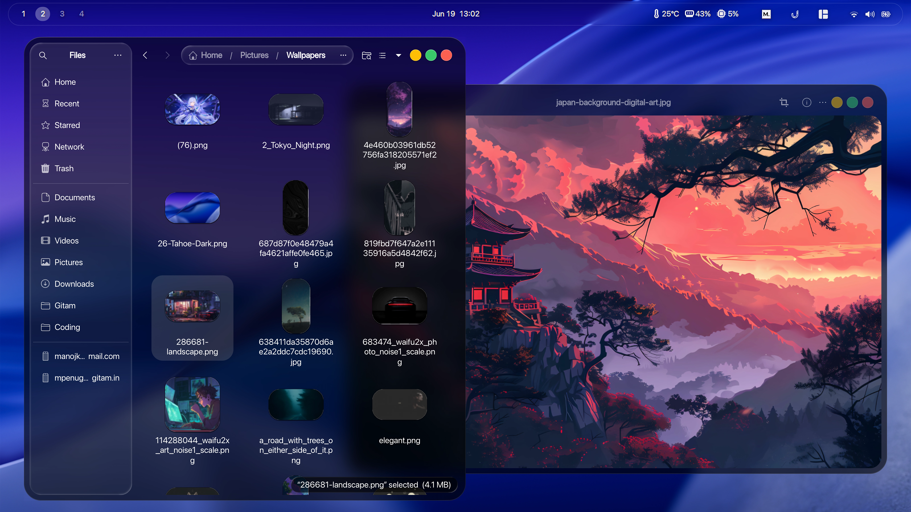
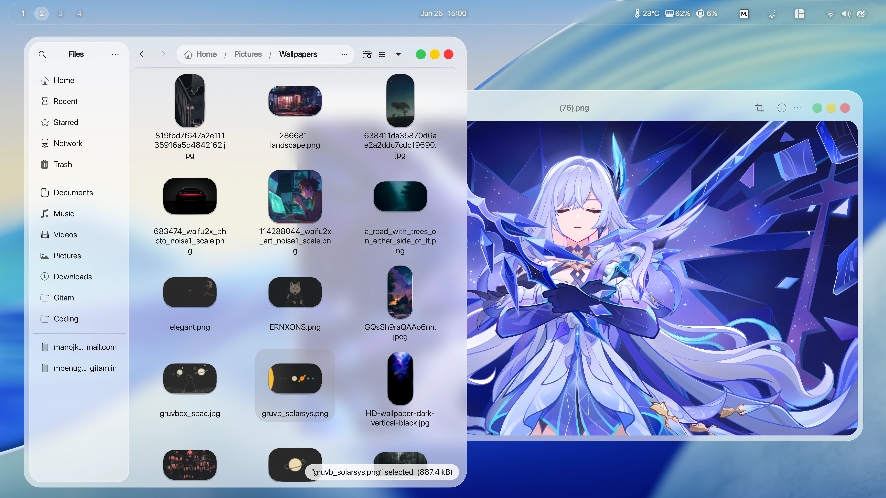

<h1 align="center"> Tahoe GTK Theme </h1>
<p align="center">  </p>
<p align="center">  </p>

<br>
<p align="center"> <b> A macOS Tahoe like theme for GNOME Desktops </b> </p>
<br>

## Donate

If you like my project, you can buy me a coffee, many thanks ❤️ !

<a href="https://www.buymeacoffee.com/kayozxo"></a>

# Installation is easy!

<details> <summary> Recommended applications </summary>

- [Ulauncher (Application Launcher)](https://ulauncher.io/#Download)
- [GNOME Tweaks]() or [Refine (Recommended)](https://flathub.org/apps/page.tesk.Refine)

</details>

<details> <summary> Recommended GNOME Shell extensions </summary>

- [Open Bar](https://extensions.gnome.org/extension/6580/open-bar/)
- [Blur My Shell](https://extensions.gnome.org/extension/3193/blur-my-shell/)
- [Dash to Dock](https://extensions.gnome.org/extension/307/dash-to-dock/)
- [Gnome 4x UI Improvements](https://extensions.gnome.org/extension/4158/gnome-40-ui-improvements/)
- [Space bar](https://extensions.gnome.org/extension/5090/space-bar/)
- [Tiling Shell](https://extensions.gnome.org/extension/7065/tiling-shell/)
- [User Themes](https://extensions.gnome.org/extension/19/user-themes/)
- [Vitals](https://extensions.gnome.org/extension/1460/vitals/)
- [Wallpapers](./.config/walls)

</details>

## Quick install

### Installing from source

1. Run `git clone https://github.com/kayozxo/GNOME-macOS-Tahoe --depth=1`
2. Run `cd GNOME-macOS-Tahoe`
3. Run:

   - `./install.sh` for both the themes
   - `./install.sh -l` for light theme
   - `./install.sh -d` for dark theme
   - `./install.sh -u` to uninstall the theme

4. <details> <summary> How to update <b>(click to open)</b> </summary>

   - Run `cd GNOME-macOS-Tahoe`
   - Run `git pull origin main`
   - Run step 3 again!

</details>

5. Then continue from [here](.config/README.md)

## Fix for libadwaita (not perfect)

<details> <summary> Details <b>(click to open)</b> </summary>

Since the release of `Gnome 43.0`, more and more built-in apps use `libadwaita` now, and libadwaita does not support custom themes, which means we cannot change the appearance of app using libadwaita through `gnome-tweaks` or `dconf-editor`. For users who love custom themes, it’s really sucks!

Anyway if anybody who still want to custom themes we can only do this way:

That is to use the `theme file` to overwrite the `gtk-4.0 configuration file`. The result is that only Fixed making all gtk4 apps use one theme and cannot be switched (even can not switch to dark mode) If you want to change a theme, you can only re-overwrite the `gtk-4.0 configuration file` with a new theme, I know this method is not perfect, But at the moment it is only possible to continue using themes for libadwaita's apps ...

</details>

Run this command to install `Tahoe` into `gtk-4.0 configuration folder` ($HOME/.config/gtk-4.0)

```bash
./install.sh -l -la        # install light theme for libadwaita
./install.sh -d -la        # install dark theme for libadwaita
```

## ✅ Done!

Reboot or log out and back in — your GNOME should now resemble **macOS Tahoe**!

If you face any issues or have questions, feel free to open an issue on the repo or drop a comment on [my Reddit post](https://www.reddit.com/r/unixporn/comments/1lt325d/gnome_macos_tahoe_v040/?utm_source=share&utm_medium=web3x&utm_name=web3xcss&utm_term=1&utm_content=share_button).
